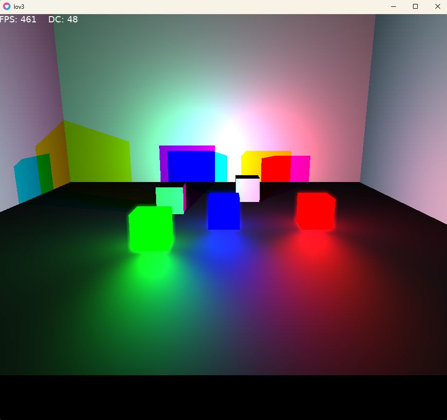
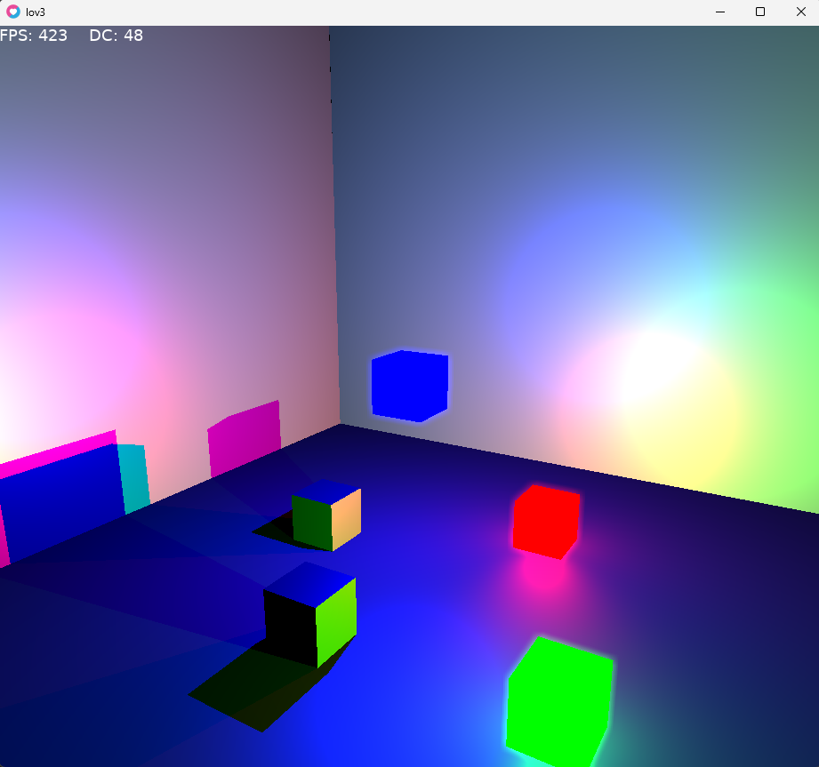
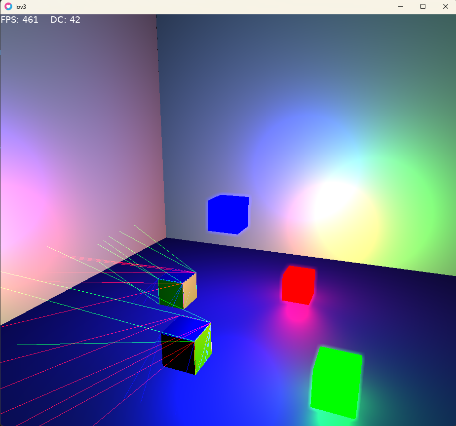

# lov3
A little 3D implementation of the love2D engine using shadow volumes

This is just a hobby project, mostly to test the feasibility of shadow volumes. Anyone is free to do what they like with this.

This requires love2D, and the entirety of the "3d-ification" of the engine lives in the single lov3.lua file.

Below is a simple example scene where some of the cubes act as differently coloured point lights (all lights are point lights in this implementation)
below that is the same scene with the shadows of each respective light as wireframes.

 
